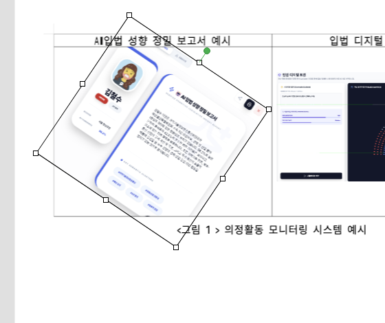
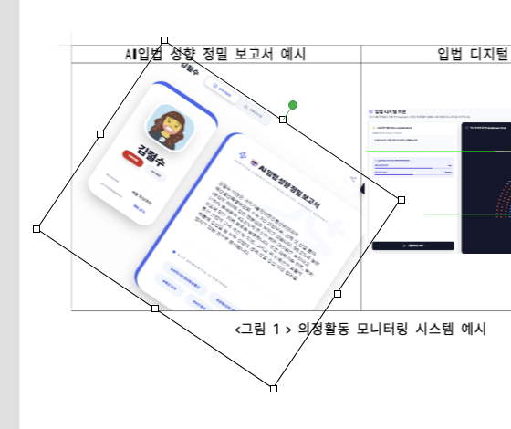

# Task 1282 최종 보고서

## 이슈

- GitHub Issue: https://github.com/edwardkim/rhwp/issues/1282
- 제목: 회전된 표 안 그림 리사이즈/셀 높이 조작 정합 개선
- 브랜치: `local/task_m100_1282`

## 변경 요약

- `set_cell_picture_properties_by_path_native`에서 표 셀 내부 picture 속성 변경 후 직접 소유 cell height를 자동 증가하도록 보정했다.
- cell height 기준은 `picture.vertOffset + picture.height + cell padding top/bottom`이다.
- 직접 표 셀 path(`path.len() == 1`)만 대상으로 하며, 글상자/깊은 중첩 path와 shrink 자동 감소는 기존 동작을 유지했다.
- `tests/issue_1282_rotated_cell_picture_resize.rs`를 추가해 리사이즈 후 cell/table height와 export/reparse 보존을 검증했다.
- `rhwp-studio/e2e/table-picture-resize-1282.test.mjs`를 추가해 실제 Studio 마우스 드래그 경로에서 cellPath, 크기, cell height, bbox 안정성, undo를 검증했다.

## 검증

통과:

```text
cargo fmt --check
cargo test --test issue_1282_rotated_cell_picture_resize -- --nocapture
cargo test --test issue_1279_picture_rotation_save
wasm-pack build --target web --out-dir pkg
cd rhwp-studio && node e2e/table-picture-resize-1282.test.mjs --mode=headless
```

## 시각 검증 자료

`build-web-apps:frontend-testing-debugging` 기준으로 Browser plugin 경로를 먼저 시도했다.

- Browser page identity: `http://localhost:7700/`, title `rhwp-studio`
- 앱 chrome DOM: 파일/편집/입력/서식 메뉴 확인
- console error/warn: 없음
- Browser screenshot: `Page.captureScreenshot` timeout으로 headless Chrome/Puppeteer 캡처 경로로 fallback

Headless Chrome 캡처:

- 전체 before: `mydocs/report/assets/task_m100_1282_resize_before.png`
- 전체 after: `mydocs/report/assets/task_m100_1282_resize_after.png`
- before crop: `mydocs/report/assets/task_m100_1282_resize_before_crop.png`
- after crop: `mydocs/report/assets/task_m100_1282_resize_after_crop.png`

확인 수치:

```text
picture height: 18160 -> 18712
owner cell height: 17476 -> 20367
required owner cell height after resize: 20367
```

Before:



After:



판정:

- 회전된 표 셀 picture의 드래그 리사이즈 전/후가 화면상으로 확인된다.
- 리사이즈 후 owner cell height가 필요한 높이까지 증가했다.
- 화면 bbox와 실제 그림이 분리되거나 picture가 사라지는 증상은 재현되지 않았다.

## 남은 사항

- PR 준비 시 전체 로컬 필수 검증과 clippy는 별도로 수행해야 한다.
- Studio offset 속성값의 signed 표시 정규화는 이번 이슈 범위 밖으로 남겼다.
